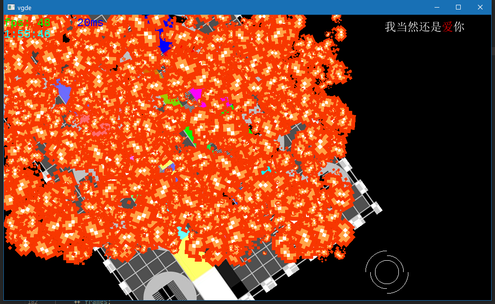

# VGDE - Video Game Development Environment

Requires C++17. Currently Windows only.

WIP - More info coming eventually.

## External libraries used by VGDE

  * _glfw_ is under the zlib/libpng license
  * _stb_image_ and _stb_image_write_ are public domain
  * _freetype_ is under the FreeType license or the GPL license
  * _glm_ is licensed under the Happy Bunny License (Modified MIT) or the MIT License
  * _glad.c_ is public domain
  * _vulkan_ is under the Apache License, Version 2.0
  * _OpenAL-Soft_ is under the LGPL license
  * _spdlog_ is under the MIT license
  * _toml++_ is under the MIT license